  

<h1>Yuyao Tang</h1>

<h3>
  ML Systems &nbsp;•&nbsp; LLM Alignment &nbsp;•&nbsp; Retrieval
</h3>

 

  

&nbsp;

&nbsp;

  

 

---

 

<picture>
  <source media="(prefers-color-scheme: dark)" srcset="https://raw.githubusercontent.com/tang923/tang923/output/github-contribution-grid-snake-dark.svg" />
  <source media="(prefers-color-scheme: light)" srcset="https://raw.githubusercontent.com/tang923/tang923/output/github-contribution-grid-snake.svg" />
  
</picture>

